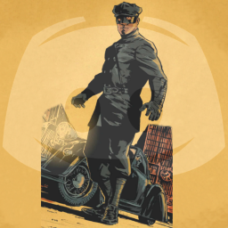

# Kato DiscordBot

A Discord Bot to assist with managing servers and their channels.

Post messages at certain times/intervals, copy tagged messages from one channel to another, etc.

Named in homage of the assistant, driver, enforcer, and friend of "The Green Hornet".

Kato in Green Hornet: Year One vol. 1, #1 (April 2011). 
Art by Aaron Campbell / Dynamite Entertainment.
 
By Source ([WP:NFCC#4](//en.wikipedia.org/wiki/Wikipedia:Non-free_content_criteria#4) "Wikipedia:Non-free content criteria"), [Fair use](https://en.wikipedia.org/w/index.php?curid=54602393 "Fair use of copyrighted material in the context of Kato (The Green Hornet)")

## LICENSE

Licensed under GNU GPLv3.

See [LICENSE](LICENSE) file for further details.